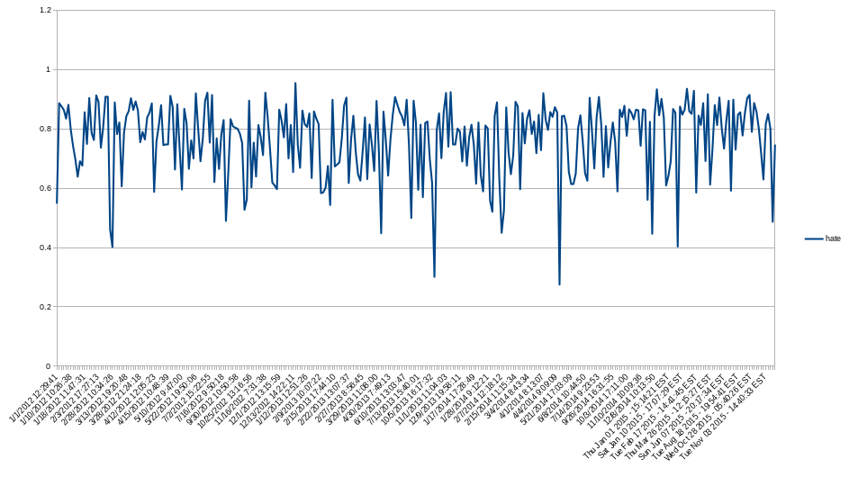

# linusrants
Just a collection of all the rants from Linus Torvalds on the kernel mailing list from 2012 to 2015 classified by the amount of hate and sorted by it.

The complete processed dataset can be found in `data.json` in json-formatted form and in `data.pkl` in pickle-formatted form, ready for consumption in python programs.

For a more easy-to-read representation, check out [the dataset in a table](table.md).

If you'd like to do some analysis or plotting of the data, the best resource for that is [the full dataset in csv format](rants.csv).

Extract from `data.json`:
```json
[  
   {  
      "text":"No it didn't. There was nothing accidental about it, and it doesn't even change it the way you claim.... Your explanation makes no sense for _another_ reason.... ... So tell us more about those actual problems, because your patch and explanation is clearly wrong. ... So this whole thing makes no sense what-so-ever.",
      "hate":0.8102418937082152
   },
   {  
      "text":"Stop the idiotic arguing already.",
      "hate":0.810709046585318
   },
   {  
      "text":"Ugh.  This is too ugly, it needs to die.  ...   Because this is unreadable.",
      "hate":0.8647894373012335
   }
]
```

## Analysis
Plot of hate levels vs time (x axis is not properly scaled):


## Build
To build it yourself just run:
```bash
python classify.py
```
Essentially, all I did was take a dataset of Linus rants already available[1] and send it through a sentiment analysis API[2], aggregating and sorting the results.

---

[1] Original raw dataset of Linus Torvalds rants can be found at https://data.world/jboutros/linus-rants

[2] http://text-processing.com/docs/sentiment.html
